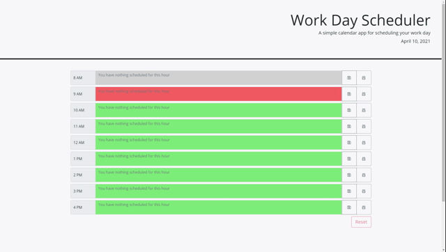

# Day-Planner

This is [a Daily Planner](https://luketeal.github.io/Day-Planner/).  

The project uses HTML, CSS, and JS as a codebase. 
The project utilizes Bootstrap, JQuery, and DayJS.

## Objectives

The web app presents the user with a series of color coded timeslots (based on the time the scheduler was loaded) and allows the user to save appointments for each hour of the work day (8 AM - 5 PM). 

## Instructions

1. Input an appointment or event into a text area and select save to save that item into local storage. 
2. The user may delete an item with the delete button and reset the whole planner with the reset button.
3. Timeslots in gray are in the past. The current hour is red. Future hours are green.

## Screenshot
The image below show's the web app's appearance and functionality:

.

## Repository Contents
The repository includes

* [HTML](./index.html) file;
* [CSS](./assets/css/style.css) file;
* [JavaScript](./assets/js/script.js) file; and
* [GIF](./assets/images) of intended functionality.

## Credits
* Index and css is based on information provided by Trilogy Education Services, LLC, a 2U, Inc. brand.
* The project utilizes Bootstrap, JQuery, and DayJS.